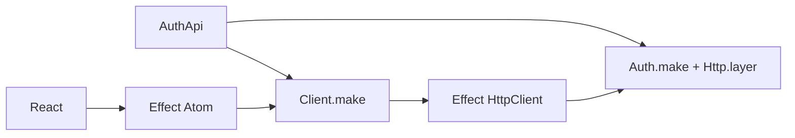

One contract supplies server methods and a typed client. Effect Atom owns client
state and workflows; Effect HttpClient owns transport.



## Define the routes

Keep the contract safe to import in both the browser and server:

```ts title="auth-contract.ts"
import { Schema } from "effect";
import { AuthContract } from "@yielded/auth";

export const AuthApi = AuthContract.make("app/Auth", {
  claims: Schema.Struct({ displayName: Schema.String }),
  actions: (sessions) => ({ signIn: AuthContract.passwordSignIn(sessions) }),
});
```

The contract includes `getSession`, `requireSession`, `signOut`, and `renewSession`.
It exposes only the additional actions you select. Installing a strategy does
not publish all its methods.

| Actions                             | HTTP method | Default path                                          |
| ----------------------------------- | ----------- | ----------------------------------------------------- |
| `getSession`, `requireSession`      | GET         | `/auth/getSession`, `/auth/requireSession`            |
| `signIn`, `signOut`, `renewSession` | POST        | `/auth/signIn`, `/auth/signOut`, `/auth/renewSession` |

No-input queries use GET. Queries with payloads use POST so their inputs stay out
of URLs. Change the shared prefix with `basePath` on `AuthContract.make`; server
and client use the same descriptors.

## Configure the server

Bind the contract to your methods and session configuration:

```ts title="auth.ts"
import { Auth, Http, Password, Sessions } from "@yielded/auth";

import { AuthApi } from "./auth-contract";

export const AppAuth = Auth.make(AuthApi, {
  sessions: Sessions.stateful(),
  strategies: { password: Password.make() },
  defaultStrategy: "password",
});

export const AuthRoutes = Http.layer(AppAuth, { origin: "https://app.example.com" });
```

`Http.layer` mounts the shared actions and configured OAuth callbacks, and
supplies `AppAuth.layer`. Provide your stores and account authority to the result.
The [adapter guide](../reference/adapters#compose-the-application-layer) shows the
`AuthDependencies` composition used below.

For an existing raw `HttpRouter`, merge the auth route Layer with your application
routes:

```ts title="routes.ts"
import { Layer } from "effect";

import { ApplicationRoutes } from "./application-routes";
import { AuthRoutes } from "./auth";
import { AuthDependencies } from "./auth-live";

export const Routes = Layer.mergeAll(AuthRoutes, ApplicationRoutes).pipe(
  Layer.provide(AuthDependencies),
);
```

### Application routes

For application routes that call auth, build the middleware with `Http.make`:

```ts title="auth-http.ts"
import { Http } from "@yielded/auth";

import { AppAuth } from "./auth";

export const http = Http.make(AppAuth, { origin: "https://app.example.com" });
```

Wrap those route Layers with `ApplicationRoutes.pipe(http.middleware,
Layer.provide(AppAuth.layer))` before merging them above.

The middleware creates fresh request context and delivers credential cookies on
the response. It accepts ordinary JSON, form, and multipart routes. Inside those
routes, call `auth.getSession()`, `auth.requireSession()`, or `auth.signOut()` after
`const auth = yield* AppAuth`. These are local Effects; they do not make HTTP calls
or require a headers argument.

### Join an existing HttpApi

Add the native auth group beside your application groups in the shared API:

```ts title="api.ts"
import { AuthContract } from "@yielded/auth";
import { HttpApi } from "effect/unstable/httpapi";

import { AuthApi } from "./auth-contract";
import { Projects } from "./projects-contract";

export const Api = HttpApi.make("app").add(Projects, AuthContract.httpGroup(AuthApi));
```

```ts title="api-server.ts"
import { Layer } from "effect";
import { HttpApiBuilder } from "effect/unstable/httpapi";

import { Api } from "./api";
import { http } from "./auth-http";
import { AuthLive } from "./auth-live";
import { ProjectHandlers } from "./projects-handlers";

export const Routes = HttpApiBuilder.layer(Api, { openapiPath: "/openapi.json" }).pipe(
  Layer.provide(http.handlers(Api)),
  Layer.provide(ProjectHandlers),
  http.middleware,
  Layer.provide(AuthLive),
);
```

Both mounting forms use the same bounded transport and handlers. The group defaults
to `auth`; pass matching `{ name: "account" }` options to `httpGroup` and `handlers`
to rename it. Middleware and annotations compose normally, with their requirements
visible in Layer types. Configure paths in the contract's `basePath` rather than
prefixing generated endpoints afterward.

The [shared contract](https://github.com/yielded-dev/auth/blob/main/examples/auth/src/auth-contract.ts)
and [server example](https://github.com/yielded-dev/auth/blob/main/examples/auth/src/auth-server.ts)
show a complete group and handler pair.

### Cookies and protected handlers

Cookies default to `Secure`, `HttpOnly`, `SameSite=Lax`, path `/`, and the
`__Host-effect-auth-` prefix. Override `cookie.name` for the session slot or
`cookie.prefix` for all slots. Plain HTTP development requires an explicit
`cookie.secure: false`. Use your real HTTPS origin; never derive trusted origins
from an untrusted request header.

POST auth actions require the configured Origin, JSON content type, and
`x-effect-auth-csrf: 1` by default. GET actions have no body or CSRF header and
reject an explicitly untrusted Origin. Duplicate credential cookies are rejected,
and session responses are not cacheable. If you override `csrf` on the server,
pass matching settings to `Client.make`.

`http.middleware` supplies context; it does not require every route to be signed
in. Call `auth.requireSession()` in protected application handlers. For declarative
HttpApi protection, define `SessionContract.makeSessionHttpContract`,
attach its `RequireSession` middleware, and read `CurrentSession` in handlers.
Provide `http.securityLayer(contract)` and apply `http.middleware` to the route
Layer. Its cookie name must match the adapter. It declares 401 for absent or
invalid sessions and 503 for unavailable verification. See the
[session HTTP example](https://github.com/yielded-dev/auth/blob/main/examples/auth/src/session-http.ts).

Named mutations enforce Origin and CSRF before side effects, including local
calls from application routes. Raw strategy methods are treated as mutations.
For a custom credential-producing workflow, call `http.protect(effect)` inside
the request boundary; it applies mutation policy and supplies private collectors
without imposing a body format. Custom hosts still own webhook validation and
ordinary application mutation policy.

## Expose another method

The method guides show the available local strategy calls. Browser access requires
an action in `AuthApi`: `AuthContract.passwordSignIn` is the password shortcut;
`AuthContract.fromOperation` reuses a pure operation contract; `AuthContract.action`
accepts explicit payload, success, and error schemas.

Each action selects a server `method` and, when needed, a `strategy`. The method
defaults to the action's name. You can expose two strategies under different names
without making the client choose a strategy string. Configure only actions your
application intends to serve. Passkey and TOTP have dedicated pure contract modules;
the email, phone, and OAuth flows currently require explicit action schemas.

Map private method inputs through `requestFields` when declaring an action:

| Method input                                                         | Credential slot      |
| -------------------------------------------------------------------- | -------------------- |
| Email, phone, or OAuth `requestBinding`; passkey `bindingCredential` | `request-binding`    |
| Email continuation `credential`                                      | `proof-continuation` |
| TOTP `pendingCredential`                                             | `pending-proof`      |

The server injects those values from `Auth.AuthRequest`; both named local calls and
remote payloads omit them. Set `credentials: true` for actions that issue or clear
credentials, declare any private reveals, and supply a `subject.fromSuccess`
projection for actions that establish or replace the authenticated account.
`fromOperation` carries forward the operation's schemas, replay policy, credential
delivery, and reveal declarations; the subject projection remains explicit.

See the [passkey contract](./passkeys#define-the-shared-actions) for a complete
example and [TOTP](./totp#expose-private-reveals-over-http) for private reveals.

## Connect client state

```ts title="auth-client.ts"
import { Atom as AuthAtom, Client } from "@yielded/auth";

import { AuthApi } from "./auth-contract";

export const AppClient = Client.make(AuthApi, { baseUrl: "https://app.example.com" });
export const auth = AuthAtom.make(AppClient);
```

`auth.session` is a query atom; `auth.signIn` and `auth.signOut` are mutation atoms.
The application registry acquires and closes the client. Fetch is configured by
default; declaring the client and atoms performs no I/O.

### React

Use ordinary `@effect/atom-react` hooks under your application's `RegistryProvider`:

```tsx title="account.tsx"
import { RegistryProvider, useAtom, useAtomValue } from "@effect/atom-react";

import { auth } from "./auth-client";

export function Account() {
  const session = useAtomValue(auth.session);
  const [signOutResult, signOut] = useAtom(auth.signOut);

  if (session._tag === "Initial") return <p>Loading…</p>;
  if (session._tag === "Failure") return <p>Session unavailable</p>;
  if (session.value === null) return <p>Signed out</p>;

  return (
    <button disabled={signOutResult.waiting} onClick={() => signOut(undefined)}>
      Sign out {session.value.claims.displayName}
    </button>
  );
}

export function App() {
  return (
    <RegistryProvider>
      <Account />
    </RegistryProvider>
  );
}
```

Reuse an existing provider if you have one. React renders and dispatches; put
multi-step logic in [workflow atoms](#compose-a-passkey-workflow).

### Compose queries

`auth.runtime` supplies the same client and account lifetime to your own atoms:

```ts title="member-name.ts"
import { Effect } from "effect";

import { AppClient, auth } from "./auth-client";

export const memberName = auth.runtime.atom(
  Effect.gen(function* () {
    const client = yield* AppClient;
    const session = yield* client.auth.getSession();

    return session?.claims.displayName ?? null;
  }),
);
```

### Invalidation and account lifetime

Auth mutations refresh auth queries automatically. To also refresh application
queries, replace the `AuthAtom.make` call with a shared runtime and reactivity keys:

```ts
import { Atom } from "effect/unstable/reactivity";

export const appRuntime = Atom.context();
export const auth = AuthAtom.make(AppClient, {
  runtime: appRuntime,
  reactivityKeys: { signIn: ["projects"], signOut: ["projects"] },
});
```

Use `appRuntime` for the queries subscribed to `"projects"` too. Account changes
dispose work and state owned by `auth.runtime`; other application atoms keep their
own lifetime. See [account lifetime](../reference/client#account-lifetime).

### Server rendering and hydration

Default atoms render `Initial` on the server without fetching. For session-aware
rendering, use request-local atoms and registries; serialize only public session
data. Follow the [hydration reference](../reference/client#server-rendering) and
[SSR example](https://github.com/yielded-dev/auth/blob/main/examples/auth/src/auth-ssr.ts)
for acquisition and cleanup.

## Use your Effect HttpClient

Replace the default `AuthAtom.make` call with explicit Layer composition:

```ts
import { Layer } from "effect";

import { ApplicationHttpClient } from "./http-client";

export const ClientLive = AppClient.layer.pipe(Layer.provide(ApplicationHttpClient));
export const auth = AuthAtom.make(AppClient, { layer: ClientLive });
```

For example, configure Effect's Fetch transport with browser credentials:

```ts title="http-client.ts"
import { Layer } from "effect";
import { FetchHttpClient } from "effect/unstable/http";

export const ApplicationHttpClient = FetchHttpClient.layer.pipe(
  Layer.provide(
    Layer.succeed(FetchHttpClient.RequestInit, {
      credentials: "include",
      redirect: "error",
    }),
  ),
);
```

Supply a transport without retries, redirects, or status filtering: auth mutations
make one attempt, and auth decodes expected failures from response bodies. A timeout
may leave a mutation committed; reconcile with the server instead of retrying it.
See [transport options](../reference/client#transport) for deadlines and native clients.

## Call the client directly

Provide `layerFetch` to a standalone Effect program:

```ts
import { Effect } from "effect";

import { AppClient } from "./auth-client";

export const session = Effect.gen(function* () {
  const client = yield* AppClient;
  return yield* client.auth.getSession();
}).pipe(Effect.provide(AppClient.layerFetch));
```

To use your transport, replace `Effect.provide(AppClient.layerFetch)` with
`Effect.provide(ClientLive)` from the previous example. To share the Atom client,
compose through `auth.runtime` instead of acquiring a separate Layer.

## Compose a passkey workflow

The [passkey guide](./passkeys) defines both the server strategy and this shared
contract:

<!--@include: ./passkeys.md#passkey-contract-->

Bind `PasskeyApi` with `Auth.make(PasskeyApi, { sessions, strategies })` on the server,
using the same passkey configuration. `requestFields` removes private inputs from
the public schema and injects them from request credentials during execution.
Neither local nor HTTP callers can supply those private fields. For new contracts,
`AuthContract.action` also accepts explicit input, success, and error schemas.

```ts title="passkey-workflow.ts"
import { Effect, Redacted } from "effect";
import { Atom as AuthAtom, Client } from "@yielded/auth";
import * as PasskeyBrowser from "@yielded/auth-simplewebauthn/Browser";

import { PasskeyApi } from "./passkey-contract";

export const PasskeyClient = Client.make(PasskeyApi, { baseUrl: "https://app.example.com" });
export const passkeys = AuthAtom.make(PasskeyClient);

export const signIn = passkeys.runtime.fn<{ flowId: string; commandId: string }>()(
  Effect.fn("app.passkeySignIn")(function* (input) {
    const client = yield* PasskeyClient;
    const browser = yield* PasskeyBrowser.make();
    const started = yield* client.auth.signIn({
      ...input,
      profileId: "default",
    });
    const response = yield* browser.authenticate({ started, mediation: "required" });

    return yield* client.auth.completeSignIn({
      flowId: input.flowId,
      response: Redacted.value(response.response),
    });
  }),
);
```

The atom owns the ceremony and cancellation. An admitted credential response
settles before publishing an account change; that change then retires this custom
workflow. Render the updated session rather than chaining UI work after its
completion. Unknown write outcomes require authoritative lookup or a fresh flow.

## Lower-level transports

`http.withRequest` wraps a custom Effect returning `HttpServerResponse`.
`http.operationLayer` supplies browser policy and caller resolution to existing
`OperationHttpServer` contracts. Those descriptors continue to own private payload
injection and explicitly selected reveals.
Encode expected response failures before leaving the request wrapper.

`OperationHttpClient.make` requires the same Effect `HttpClient` service.
`AuthAtom.query`, `AuthAtom.mutation`, and `AuthAtom.workflow` remain available for
custom integration. Private reveals belong in a finite
collector, outside ordinary query caches, logs, and persisted client state.
