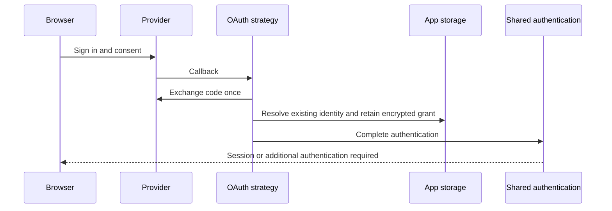

An **app session** identifies your signed-in user. A **provider grant** lets your
server call a provider's API. Configure both through an OAuth strategy in `Auth.make`.
Your app owns accounts, claims, and permission policy.

| Your app needs                                             | Strategy                                                       |
| ---------------------------------------------------------- | -------------------------------------------------------------- |
| Sign in with an existing account link                      | `OAuth.make()`                                                 |
| Sign in and retain provider API access in the same consent | `OAuth.make({ access: profile })`                              |
| Create an account after provider verification              | `OAuth.makeRegistration({ registration, registrationPolicy })` |
| Link another login method                                  | `OAuth.makeAccounts({ policy })`                               |
| Connect an API to an already authenticated account         | `OAuth.makeConnected({ policy })`                              |

## Sign in and retain provider access

```ts title="apps/server/auth.ts"
import { Auth, Sessions } from "@yielded/auth";
import { OAuth } from "@yielded/auth/strategies";
import * as GitHub from "@yielded/auth-openid-client/GitHub";
import { AuthApi } from "@app/domain/auth-contract";
import { clientId } from "./config";

const profile = GitHub.accessProfile({ clientId, scopes: ["read:user"] });

export const AppAuth = Auth.make(AuthApi, {
  sessions: Sessions.stateful(),
  strategies: { social: OAuth.make({ access: profile }) },
  defaultStrategy: "social",
});
```

Omit `access` to discard provider tokens after verifying identity. With `access`,
the strategy encrypts and saves the grant before completing authentication through
the same session authority used by passwords, passkeys, and email. Choose stateful,
stateless, or state-assisted sessions independently.



Declare the [OAuth actions](../reference/oauth#shared-auth-setup), then configure
`Http.make` with `GitHub.provider({ clientId, clientSecret, access: [profile] })`.
The HTTP adapter owns callback routing and private cookie delivery. Supply shared
sign-in and connected persistence, account claims, and separate transaction/token
keyrings through Layers. The [runnable composition](https://github.com/yielded-dev/auth/blob/main/examples/auth/src/oauth-application.ts)
shows the full setup; [GitHub](https://github.com/yielded-dev/auth/blob/main/examples/auth/src/github-app.ts)
and [Strava](https://github.com/yielded-dev/auth/blob/main/examples/auth/src/strava-app.ts)
provide concrete configuration and a single-account allowlist.

Retained sign-in currently requires an existing local account link. For new users,
use registration first, then connect provider access after authentication.

### Use the session and provider access

Under the HTTP middleware, use the regular Auth API:

```ts
const auth = yield * AppAuth;
const session = yield * auth.requireSession();
const connections = yield * auth.listAccountConnections({ limit: 20 });
```

The server-side connected service handles refresh and token use:

```ts
const access = yield * AppAuth.strategies.social.access.ConnectedAccess;
yield * access.withAccessToken(invocation, { grantId, profileKey: profile.key }, readProfile);
```

Provide `AppAuth.strategies.social.access.accessLayer` with the same connected
services. `invocation` must come from a verified session or a trusted job authority;
the service rechecks the subject, grant, and application permission. `readProfile`
receives a redacted token and is never retried by the library. Refresh does not
upgrade session assurance. Provider tokens never enter browser results or sessions.

`auth.disconnectAccount` uses the same connected-grant authority. Provider revocation
depends on the profile; cohort revocation needs the shared maintenance worker.
See [retained access](../reference/oauth#retained-access) for dependencies and recovery.

## Authorize MCP clients

`OAuthServer` lets a signed-in user grant a registered MCP client access to your
application. `Auth` supplies the application session; the OAuth strategy owns retained
upstream provider credentials. The two grants stay separate:

```text
Browser → Application login → OAuthServer consent → MCP client
                                                      ↓ MCP token
                                                Effect McpServer
                                                      ↓ Authenticated subject
                                             Your handler and policy
                                                      ↓ Optional provider access
                                             OAuth strategy → Provider API
```

Define supported scopes, supply an identity service that verifies your existing
session, and mount the authorization routes beside Effect's MCP routes:

```ts
const oauth = OAuthServer.make("mcp", { scopes: ["athlete:read"] });

const protectedMcp = McpServer.toolkit(toolkit).pipe(
  Layer.provide(handlers),
  Layer.provide(
    McpServer.layerHttp({
      name: "Athlete tools",
      version: "1.0.0",
      path: "/mcp",
      protocols: [McpProtocol.v2026_07_28],
    }),
  ),
  Layer.provide(oauth.middleware(["athlete:read"]).layer),
);
```

The [runnable Strava MCP example](https://github.com/yielded-dev/auth/blob/main/examples/auth/src/strava-mcp.ts)
provides the login, SQL migration, signing keys, client registration, CORS, and
server. It uses the built-in consent page and a single allowlisted athlete; its
tool returns the authenticated subject without calling Strava's API.

Inside a tool handler, read `OAuthServer.CurrentAccess`; reject `undefined`.
The value contains the authenticated `subjectId`, `clientId`, resource, scopes,
and grant ID. Your application still decides which accounts and operations that
subject may access. Your application owns the subject-to-provider connection
mapping. Resolve that connection from trusted storage, then call `withAccessToken`
on the strategy’s `access.ConnectedAccess` service; MCP clients never receive provider tokens.

This initial server supports explicitly registered public clients. Clients must
support supplying their registered client ID; there is no dynamic registration
or Client ID Metadata Document endpoint. See the
[authorization server reference](../reference/oauth#authorization-server) for
the setup and token lifecycle.

## Other providers

`OpenIdClient.provider` supports OIDC discovery and plain OAuth endpoints.
Its optional `access` settings declare permission profiles and the provider's
refresh/resource/revocation contract. A custom `ProviderDefinition.configure`
returns the sign-in protocol and optionally a `connected` protocol. Configuration,
secrets, and required services remain in the provider Layer.
See [provider configuration](../reference/oauth#providers).

The [combined login example](https://github.com/yielded-dev/auth/blob/main/examples/auth/src/login-server.ts)
shares sessions across email, GitHub, and Google. Provider display metadata never
authorizes linking accounts by matching email addresses.
